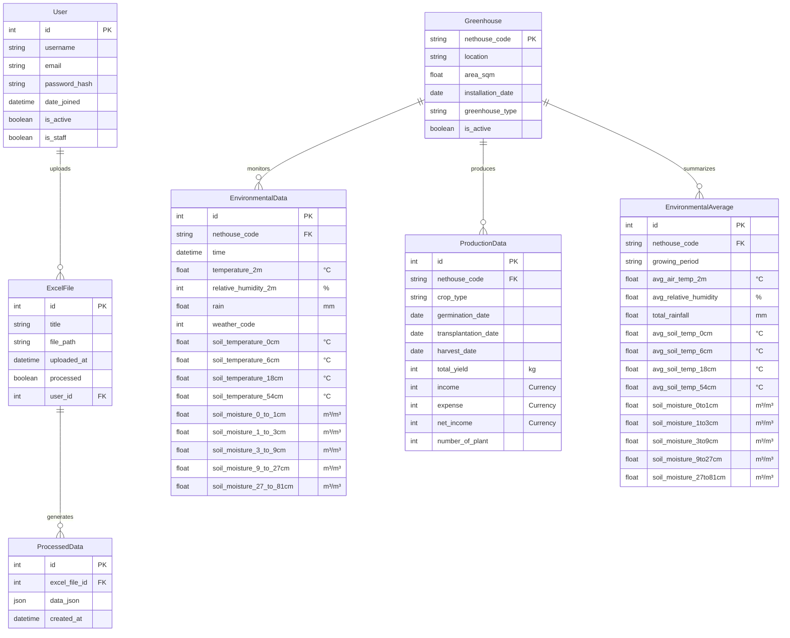

```mermaid
erDiagram
    %% Core User and File Management
    User ||--o{ ExcelFile : uploads
    ExcelFile ||--o{ ProcessedData : generates
    
    %% Environmental Data
    Greenhouse ||--o{ EnvironmentalData : monitors
    Greenhouse ||--o{ ProductionData : produces
    Greenhouse ||--o{ EnvironmentalAverage : summarizes
    
    %% User Entity
    User {
        int id PK
        string username
        string email
        string password_hash
        datetime date_joined
        boolean is_active
        boolean is_staff
    }
    
    %% File Management Entities
    ExcelFile {
        int id PK
        string title
        string file_path
        datetime uploaded_at
        boolean processed
        int user_id FK
    }
    
    ProcessedData {
        int id PK
        int excel_file_id FK
        json data_json
        datetime created_at
    }
    
    %% Greenhouse Entity
    Greenhouse {
        string nethouse_code PK
        string location
        float area_sqm
        date installation_date
        string greenhouse_type
        boolean is_active
    }
    
    %% Environmental Data Table
    EnvironmentalData {
        int id PK
        string nethouse_code FK
        datetime time
        float temperature_2m "°C"
        int relative_humidity_2m "%"
        float rain "mm"
        int weather_code
        float soil_temperature_0cm "°C"
        float soil_temperature_6cm "°C"
        float soil_temperature_18cm "°C"
        float soil_temperature_54cm "°C"
        float soil_moisture_0_to_1cm "m³/m³"
        float soil_moisture_1_to_3cm "m³/m³"
        float soil_moisture_3_to_9cm "m³/m³"
        float soil_moisture_9_to_27cm "m³/m³"
        float soil_moisture_27_to_81cm "m³/m³"
    }
    
    %% Production Data Table
    ProductionData {
        int id PK
        string nethouse_code FK
        string crop_type
        date germination_date
        date transplantation_date
        date harvest_date
        int total_yield "kg"
        int income "Currency"
        int expense "Currency"
        int net_income "Currency"
        int number_of_plant
    }
    
    %% Environmental Averages Table
    EnvironmentalAverage {
        int id PK
        string nethouse_code FK
        string growing_period
        float avg_air_temp_2m "°C"
        float avg_relative_humidity "%"
        float total_rainfall "mm"
        float avg_soil_temp_0cm "°C"
        float avg_soil_temp_6cm "°C"
        float avg_soil_temp_18cm "°C"
        float avg_soil_temp_54cm "°C"
        float soil_moisture_0to1cm "m³/m³"
        float soil_moisture_1to3cm "m³/m³"
        float soil_moisture_3to9cm "m³/m³"
        float soil_moisture_9to27cm "m³/m³"
        float soil_moisture_27to81cm "m³/m³"
    }
```
